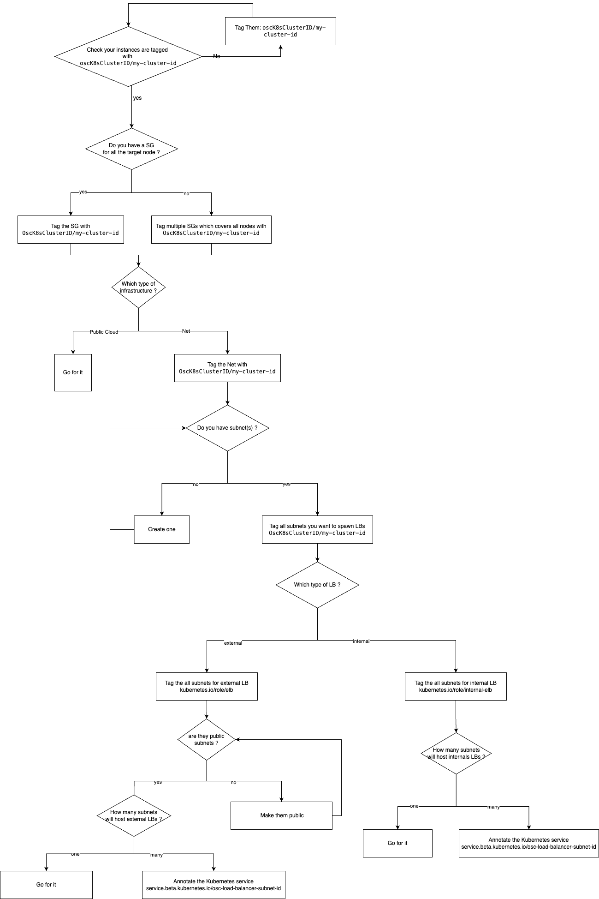

This documentation explains how to deploy Outscale Cloud Controller Manager.

# Prerequisites

You will need a Kubernetes cluster on 3DS Outscale cloud. The next sections details prerequisites on some cloud resources.

| Plugin Version  | Minimal Kubernetes Version | Recommended Kubernetes Version |
| --------------- | -------------------------- | ------------------------------ |
|  <= v0.0.10beta | 1.20                       | 1.23                           |
| v0.2.1 - v0.2.3 | 1.20                       | 1.25                           |
| v0.2.4 - v0.2.8 | 1.20                       | 1.30                           |
|     v1.0.x      | 1.20                       | 1.31                           |

# Tagging

## Cluster Resource Tagging

The CCM expects resources to be tagged as being part of the cluster.
This includes:
- [Subnets](https://docs.outscale.com/en/userguide/About-VPCs.html)
- [Instances](https://docs.outscale.com/en/userguide/About-Instances.html)
- [Security Groups](https://docs.outscale.com/en/userguide/About-Security-Groups-(Concepts).html)

The tag key must be `OscK8sClusterID/[cluster-id]` (`[cluster-id]` being the ID of a cluster) and tag value can be one of the following values:
- `shared`: resource is shared between multiple clusters, and should not be destroyed,
- `owned`: the resource is considered owned and managed by the cluster.

The CCM will fetch the `OscK8sClusterID` tag of the node it is running on and will expect to find the other resources with matching tag keys.

The Cluster API Provider for Outscale (CAPOSC) sets the tag, no need to do anything.

## Instances Tagging

The CCM is usually able to find instances.

In some rare cases, the CCM needs a `OscK8sNodeName` tag on the VM, with the node name as a value.

The Cluster API Provider for Outscale (CAPOSC) sets the tag, no need to do anything.

# Creating load-balancers

## Subnets

The CCM will look for a subnet having one of the following tags:
* `OscK8sRole/service.internal` is service is internal,
* `OscK8sRole/service` is service is not internal or if no `OscK8sRole/service.internal` subnet is found,
* `OscK8sRole/loadbalancer` if no subnet found.

The Cluster API Provider for Outscale (CAPOSC) automatically sets the `OscK8sRole/loadbalancer` tag to the subnet where the Kubernetes API load-balancer is configured.

## Security Groups

### Ingress

By default, the service controller will automatically create a Security Group for each Load Balancer Unit (LBU) and will attach it to nodes in a VPC setup.

If you want to use a pre-created Security Group to be used, you can set the `service.beta.kubernetes.io/osc-load-balancer-security-group` annotation with the id of the security group to use.

You can also add additional security groups using the `service.beta.kubernetes.io/osc-load-balancer-extra-security-groups` annotation.

The CCM will automatically add manage ingress rules to allow traffic to the load-balancer.

You can set `service.Spec.LoadBalancerSourceRanges` to restrict trafic to a list of IP ranges.

### Load-balancer to nodes

The CCM will add rules to allow trafic from the load-balancer to nodes.

Within node security groups, it will search for a security group having one of the following tags:
* `OscK8sRole/[role]`, with role being set with de `service.beta.kubernetes.io/osc-load-balancer-target-role` annotation (`worker` by default)
* `OscK8sMainSG/[cluster id]`.

The Cluster API Provider for Outscale (CAPOSC) sets a `OscK8sRole/worker` tag on all worker nodes, and allows you to add custom roles if needed.

## Networking

Node controller is deployed as a daemon set on control-plane nodes and will need to access [metadata server](https://docs.outscale.com/en/userguide/Accessing-the-Metadata-and-User-Data-of-an-Instance.html) in order to get information about its node (cpu, memory, addresses, hostname).
To do this, node controller need to be able to access `169.254.169.254/32` through TCP port 80 (http).

## Kubelet

Kubelet must be run with `--cloud-provider=external`, (more details in [Cloud Controller Manager Administration](https://kubernetes.io/docs/tasks/administer-cluster/running-cloud-controller/#running-cloud-controller-manager) documentation).

## Configuring Cloud Credentials

Outscale Cloud Controller Manager needs to access the Outscale API.

It is recommended to use a specific [Access Key](https://docs.outscale.com/en/userguide/About-Access-Keys.html) and create an [EIM user](https://docs.outscale.com/en/userguide/About-EIM-Users.html) with limited access. Check [EIM policy example](eim-policy.example.json) to apply to such EIM user.

# Deploy

## Add Secret

Create a secret with your cloud credentials:
```
  kubectl create secret generic osc-secret \
    --from-literal=access_key=$OSC_ACCESS_KEY --from-literal=secret_key=$OSC_SECRET_KEY \
    -n kube-system
```

## Add Cloud Controller Manager

You can then deploy Outscale Cloud Controller Manager using a simple manifest:
```
kubectl apply -f deploy/osc-ccm-manifest.yml
```

Alternatively, you can deploy using Helm:
```
helm upgrade --install --wait --wait-for-jobs k8s-osc-ccm oci://registry-1.docker.io/outscalehelm/osc-cloud-controller-manager --set oscSecretName=osc-secret
```
More [helm options are available](../docs/helm.md)

# Upgrading to v1.0

The secret has now the same format as the CSI driver. You need to rename:
* `key_id` to `access_key`,
* `access_key` to `secret_key`.

All other entries can be deleted.

If you use an EIM user, you also need to update your policies with [the updated EIM policy](eim-policy.example.json).

# Troubleshooting

When troubleshooting issues, you can follow this debug tree to identify and resolve common problems.

## Debug Tree


